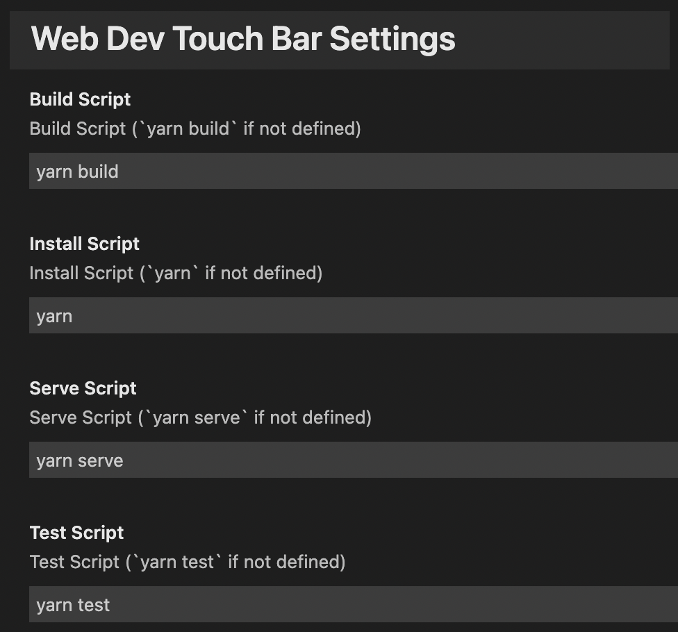

# Web development commands of Macbook Touch Bar panel for VS Code

This extension allows you to use your MacBook Touch Bar panel most productively while you are developing web projects using VS Code.

## Features

Touch Bar will look like:

1. 💾 Save All function
2. 📦 Install dependencies script (like `yarn`)
3. ✈️ Serve project script (like `yarn serve`)
4. 🛠 Build project script (like `yarn build`)
5. 🪲 Run tests script (like `yarn test`)

All scripts can be set via `Extension settings`:

## Settings

You can choose the commands mentioned above using the following settings:

* `touch-bar-web-dev.installScript`: Install Script (`yarn` if not defined)
* `touch-bar-web-dev.serveScript`: Serve Script (`yarn serve` if not defined)
* `touch-bar-web-dev.buildScript`: Build Script (`yarn build` if not defined)
* `touch-bar-web-dev.testScript`: Test Script (`yarn test` if not defined)

## Contributing

Please follow the general rules when improving this extension. It can be found [here](https://code.visualstudio.com/api/references/extension-guidelines). Any help is appreciated! :)

## Donate

Buy me a Coffee

- **ETH** 0x7296446105e628f9995d2723c328bce79623df74
- **BTC** 1DVbQoijXQ4yqjoLNPuha51c16o3iJsasu
- **DOT** 15ZuyCrkVRGRMkrQwChhCy3jtjPZiDHSFiTzbVsHeEwYbhbk

**Enjoy!**
